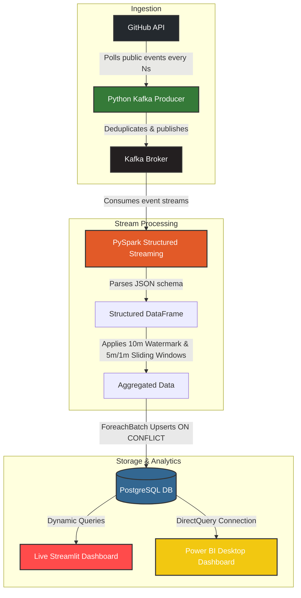

# 📊 Real-Time GitHub Event Processing Pipeline

A premium, end-to-end, real-time data engineering pipeline designed to ingest, process, store, and visualize public GitHub events at scale. Built with a modern data stack including **Python**, **Apache Kafka**, **Apache Spark (Structured Streaming)**, **PostgreSQL**, **Streamlit**, and **Docker**.

---

## 🏗️ Architecture Overview

The pipeline leverages a robust, fault-tolerant, and asynchronous architecture, designed to handle high-throughput event streams seamlessly:



### Key Components

1. **Ingestion Layer ([producer/](file:///c:/Users/Sanjeev/OneDrive/Desktop/Real-Time%20GitHub%20Event%20Processing%20Pipeline/github-event-pipeline/producer))**: A robust Python producer that polls the GitHub Events API. It utilizes a `seen_set` backed by a bounded double-ended queue (`deque`) to ensure only unique events are published to Kafka, preventing duplicate processing.
2. **Buffering & Messaging (`Kafka`)**: Serves as a highly resilient event buffer, decoupling the ingestion layer from Spark's consumption speeds and ensuring no data loss.
3. **Processing Layer ([streaming/](file:///c:/Users/Sanjeev/OneDrive/Desktop/Real-Time%20GitHub%20Event%20Processing%20Pipeline/github-event-pipeline/streaming))**: PySpark Structured Streaming consumes the raw events, parses them into a strict schema, and registers event timestamps. It implements **watermarking (10 mins)** to elegantly handle out-of-order logs, and aggregates repository and event type counts using **sliding windows (5-minute duration, 1-minute slide)**.
4. **Storage ([database/](file:///c:/Users/Sanjeev/OneDrive/Desktop/Real-Time%20GitHub%20Event%20Processing%20Pipeline/github-event-pipeline/database))**: Aggregated micro-batches are written in parallel across Spark executor partitions into a PostgreSQL database. It utilizes `INSERT ... ON CONFLICT DO UPDATE` (upserts) to maintain exact real-time frequency aggregates.
5. **Visualization Layer ([dashboards/](file:///c:/Users/Sanjeev/OneDrive/Desktop/Real-Time%20GitHub%20Event%20Processing%20Pipeline/github-event-pipeline/dashboards))**:
   - **Streamlit**: A highly interactive, local Python web dashboard that fetches live statistics, updates on a configurable timer, and includes filtering capabilities.
   - **Power BI**: Connecting natively to Postgres using DirectQuery for corporate-ready BI reporting, complete with a professional dark mode setup specification.

---

## 🚀 Getting Started

Follow these steps to deploy the complete pipeline locally on your machine:

### 1. Prerequisites
Ensure you have the following installed on your machine:
- **Docker & Docker Compose** (Desktop/Engine version 20.10+)
- **Git**

### 2. Configure Environment Variables
Copy `.env.example` to a new `.env` file in the root directory:
```bash
cp .env.example .env
```

Open `.env` and fill in the values:
- **`POSTGRES_PASSWORD`**: Must be a long, randomly generated secret. Do not use the example value in a shared or production environment.
- **`GITHUB_TOKEN`**: While optional, it is **highly recommended** to supply a Personal Access Token (PAT). Unauthenticated requests are limited by GitHub to 60/hour, while authenticated requests enjoy **5,000/hour**, allowing seamless continuous streaming.
- Customize database credentials, polling interval (`POLL_INTERVAL_SECONDS`), or Spark window settings if desired.

### 3. Spin up the Container Stack
Build and deploy all services in the background using Docker Compose:
```bash
docker compose up --build -d
```

For a production deployment, terminate TLS and restrict access to the dashboard and database at an ingress/firewall layer. Keep PostgreSQL and Kafka private; only expose the dashboard through authenticated access.

This starts:
- **PostgreSQL**: Serving as the analytical data warehouse.
- **Kafka**: Broker instance configured using KRaft mode (no Zookeeper required).
- **GitHub Producer**: Polling & publishing to Kafka.
- **Spark Streaming Job**: Processing, aggregating, and writing to Postgres.
- **Streamlit**: Hosting the real-time visualization at `http://localhost:8501`.

### 4. Monitor Container Health
To view container startup logs or trace live performance, run:
```bash
docker compose logs -f
```

The Spark checkpoint is stored in the `spark_checkpoints` volume so the stream can resume after container restarts. Back up PostgreSQL and this checkpoint volume according to your recovery objectives.

---

## 🗂️ Project Structure

```text
github-event-pipeline/
├── dashboards/
│   ├── app.py                # Streamlit dashboard application
│   ├── Dockerfile            # Streamlit container configuration
│   ├── requirements.txt      # Dashboard python dependencies
│   └── README.md             # Guide on Power BI & Streamlit configuration
├── database/
│   └── init.sql              # PostgreSQL DDL table schemas and indexes
├── producer/
│   ├── app.py                # Python API poll & Kafka publishing service
│   ├── Dockerfile            # Producer container configuration
│   └── requirements.txt      # Producer python dependencies
├── streaming/
│   ├── spark_job.py          # PySpark Structured Streaming engine
│   ├── Dockerfile            # Spark container (includes PySpark & Kafka connector)
│   └── requirements.txt      # Streaming engine python dependencies
├── docker-compose.yml        # Orchestration layer for local services
├── .env.example              # Template configuration variables
└── README.md                 # Project documentation (You are here!)
```

---

## 📊 Visualizing Results

### Live Streamlit Web App
Once the stack is running, navigate to **[http://localhost:8501](http://localhost:8501)** in your web browser. 

The dashboard provides:
* **Live KPI Counters** tracking overall processed events, unique repositories, and latest update timestamps.
* **Top 10 Active Repositories** bar chart featuring a gradient palette.
* **Distribution of Event Types** donut chart reflecting incoming event composition (e.g. `PushEvent`, `WatchEvent`).
* **Time-Series Frequency Graph** showing event waves over sliding windows.
* Live filter sliders to customize the dashboard refresh speed (2s to 60s) or isolate particular event types.

### Power BI Desktop Integration
For corporate business intelligence analytics, connect Power BI directly to PostgreSQL:
1. Choose **DirectQuery** mode to query the database dynamically.
2. Build optimized visual sets (Theme suggestions: `#0B0E14` backgrounds with `#161B22` sleek card grids).
3. Set **Page Refresh** frequency to **5 seconds** for an active dashboard experience.
*(Detailed connection instructions can be found in the [dashboards/README.md](file:///c:/Users/Sanjeev/OneDrive/Desktop/Real-Time%20GitHub%20Event%20Processing%20Pipeline/github-event-pipeline/dashboards/README.md) file)*.

---

## ⚙️ Engineering Details

### ⚡ Deduplication Mechanics
To maintain high reliability, the Python ingest system utilizes a bounded queue of size 1000 tracking recent `event_id` keys. If an event is re-received during a quick poll, it is omitted instantly, ensuring that Kafka never processes duplicates.

### 🌊 Fault Tolerance & Checkpointing
The PySpark Structured Streaming job writes to storage with checkpointing enabled (`/tmp/spark-checkpoints-github-events`). If the Spark cluster restarts or encounters network latency, it resumes exactly where it left off, preventing data gaps or duplicates.

### 🛡️ Secure Database Upserts
Spark writes using partition-level database connections (`df.foreachPartition`). Within each executor partition, `psycopg2` opens a database transaction, batching inserts using:
```sql
INSERT INTO repository_activity (window_start, window_end, repository_name, event_type, event_count)
VALUES (%s, %s, %s, %s, %s)
ON CONFLICT (window_start, window_end, repository_name, event_type)
DO UPDATE SET event_count = EXCLUDED.event_count;
```
This ensures high efficiency, database integrity, and idempotent batch writes.
